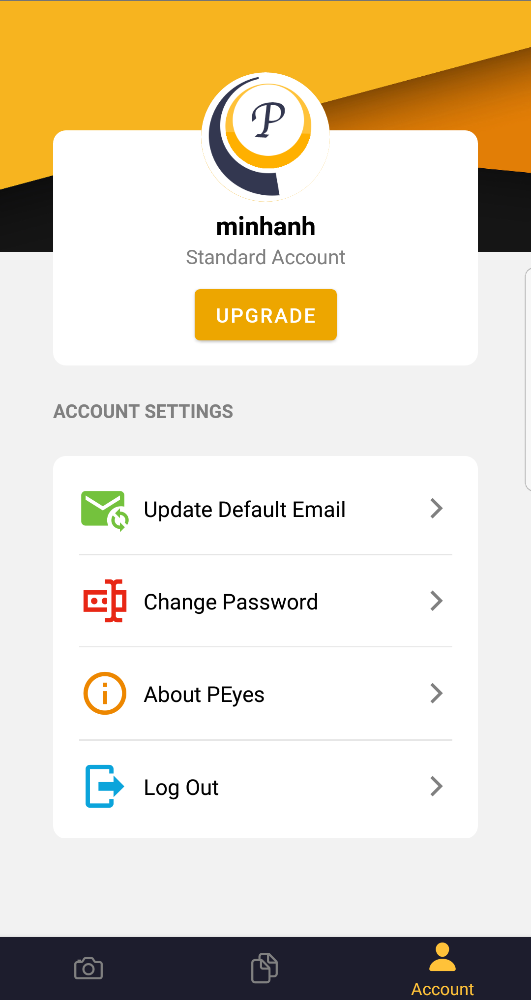

# PEyes - Text Recognition App
Author: *Minh Anh Nguyen*  
A React Native project that perfroms text detection on images using Cloud Vision API. 

## Installation
1. Clone the project

```
mkdir PEyes
git clone https://github.com/minhanh29/PEyes.git
```

2. Install dependencies

```
npm install
```

3. Run the project (make sure you have an emulator running or a phone connected)

```
react-native run-android
(or) react-native run-ios
```

## Functionalities
### Authentication
You have to create an account before using PEyes  



### Image Capturing and Cropping
A fully functioning camera to capture real time images.  
Moreover, you can also choose an image from your gallery.  
The captured or chosen image can be cropped, rotated, or scaled to give better text detection performance.  


### Editing and Saving
The generated text can be manually editted and saved as a Word Document  


### Email Sending
The Word document can be sent to your registed email so that you can download it frorm your PC.

